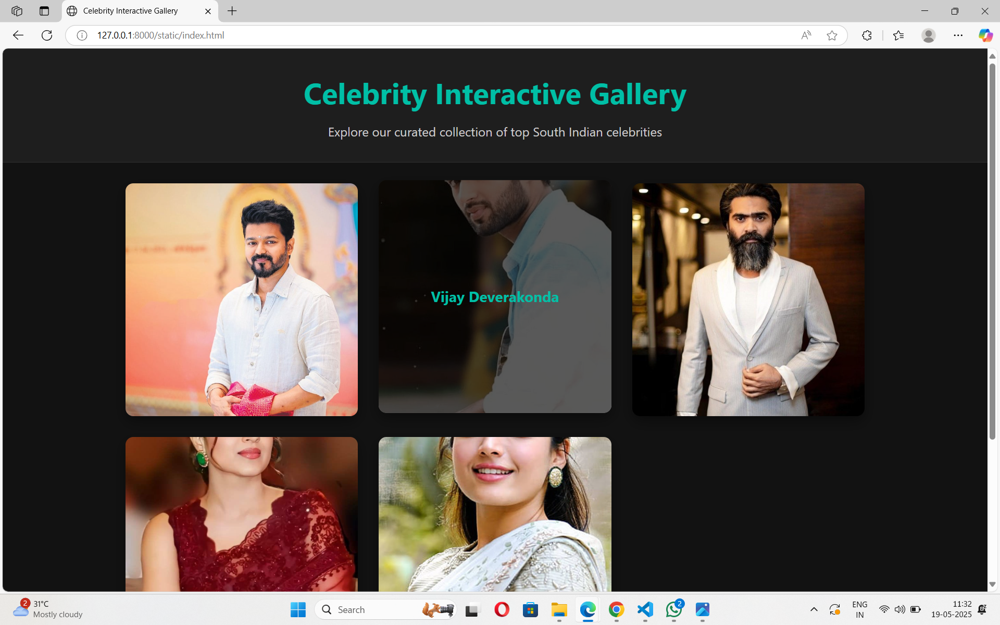

# Ex.08 Design of Interactive Image Gallery
## Date:19/05/25

## AIM:
To design a web application for an inteactive image gallery with minimum five images.

## DESIGN STEPS:

### Step 1:
Clone the github repository and create Django admin interface.

### Step 2:
Change settings.py file to allow request from all hosts.

### Step 3:
Use CSS for positioning and styling.

### Step 4:
Write JavaScript program for implementing interactivity.

### Step 5:
Validate the HTML and CSS code.

### Step 6:
Publish the website in the given URL.

## PROGRAM :
```
<!DOCTYPE html>
<html lang="en">
<head>
  <meta charset="UTF-8" />
  <meta name="viewport" content="width=device-width, initial-scale=1.0"/>
  <title>Celebrity Interactive Gallery</title>
  <style>
    * {
      margin: 0;
      padding: 0;
      box-sizing: border-box;
      font-family: 'Segoe UI', Tahoma, Geneva, Verdana, sans-serif;
    }

    body {
      background-color: #121212;
      color: #e0e0e0;
      line-height: 1.6;
    }

    header {
      background: #1e1e1e;
      padding: 2rem 1rem;
      text-align: center;
      border-bottom: 1px solid #333;
    }

    header h1 {
      font-size: 2.8rem;
      color: #00bfa6;
      margin-bottom: 0.5rem;
    }

    header p {
      font-size: 1.2rem;
      color: #ccc;
    }

    main {
      padding: 2rem;
      max-width: 1200px;
      margin: 0 auto;
    }

    .gallery {
      display: grid;
      grid-template-columns: repeat(auto-fit, minmax(280px, 1fr));
      gap: 2rem;
    }

    .gallery-item {
      position: relative;
      border-radius: 12px;
      overflow: hidden;
      box-shadow: 0 8px 20px rgba(0, 0, 0, 0.4);
      transition: transform 0.3s ease;
    }

    .gallery-item:hover {
      transform: translateY(-5px);
    }

    .gallery-item::before {
      content: '';
      display: block;
      padding-top: 100%;
    }

    .gallery-item img {
      position: absolute;
      width: 100%;
      height: 100%;
      object-fit: cover;
      top: 0;
      left: 0;
      cursor: pointer;
    }

    .overlay {
      position: absolute;
      top: 0;
      left: 0;
      width: 100%;
      height: 100%;
      background: rgba(0, 0, 0, 0.65);
      display: flex;
      align-items: center;
      justify-content: center;
      opacity: 0;
      transition: opacity 0.3s ease;
    }

    .overlay p {
      font-size: 1.4rem;
      color: #00bfa6;
      font-weight: bold;
    }

    .gallery-item:hover .overlay {
      opacity: 1;
    }

    .modal {
      display: none;
      position: fixed;
      z-index: 1000;
      left: 0;
      top: 0;
      width: 100%;
      height: 100%;
      background-color: rgba(18, 18, 18, 0.95);
      justify-content: center;
      align-items: center;
    }

    .modal-content {
      max-width: 90%;
      max-height: 90%;
    }

    .modal img {
      width: 100%;
      height: auto;
      border-radius: 8px;
      border: 2px solid #00bfa6;
    }

    .close {
      position: absolute;
      top: 20px;
      right: 30px;
      color: #ffffff;
      font-size: 2rem;
      cursor: pointer;
      background: transparent;
      border: none;
    }

    footer {
      background: #1e1e1e;
      text-align: center;
      padding: 2rem 1rem;
      margin-top: 2rem;
      border-top: 1px solid #333;
    }

    footer p {
      color: #aaa;
      font-size: 0.95rem;
    }

    .footer-credits {
      margin-top: 0.5rem;
      font-size: 0.9rem;
      color: #00bfa6;
    }
  </style>
</head>
<body>
  <header>
    <h1>Celebrity Interactive Gallery</h1>
    <p>Explore our curated collection of top South Indian celebrities</p>
  </header>
  <main>
    <section class="gallery">
      <div class="gallery-item">
        
        <div class="overlay"><p>Vijay</p></div>
      </div>
      <div class="gallery-item">
        
        <div class="overlay"><p>Vijay Deverakonda</p></div>
      </div>
      <div class="gallery-item">
        
        <div class="overlay"><p>Simbu</p></div>
      </div>
      <div class="gallery-item">
        
        <div class="overlay"><p>Trisha</p></div>
      </div>
      <div class="gallery-item">
        
        <div class="overlay"><p>Rashmika</p></div>
      </div>
    </section>
  </main>

  <div class="modal" id="myModal">
    <span class="close" onclick="closeModal()">&times;</span>
    <div class="modal-content">
      
    </div>
  </div>

  <footer>
    <p>&copy; 2024 Celebrity Gallery. All Rights Reserved.</p>
    <p class="footer-credits">Designed and Developed by HARRISH P</p>
  </footer>

  <script>
    function openModal(img) {
      var modal = document.getElementById("myModal");
      var modalImg = document.getElementById("modal-img");
      modal.style.display = "flex";
      modalImg.src = img.src;
    }

    function closeModal() {
      document.getElementById("myModal").style.display = "none";
    }

    window.onclick = function(event) {
      var modal = document.getElementById("myModal");
      if (event.target == modal) {
        modal.style.display = "none";
      }
    };
  </script>
</body>
</html>

```

## OUTPUT:



## RESULT:
The program for designing an interactive image gallery using HTML, CSS and JavaScript is executed successfully.
